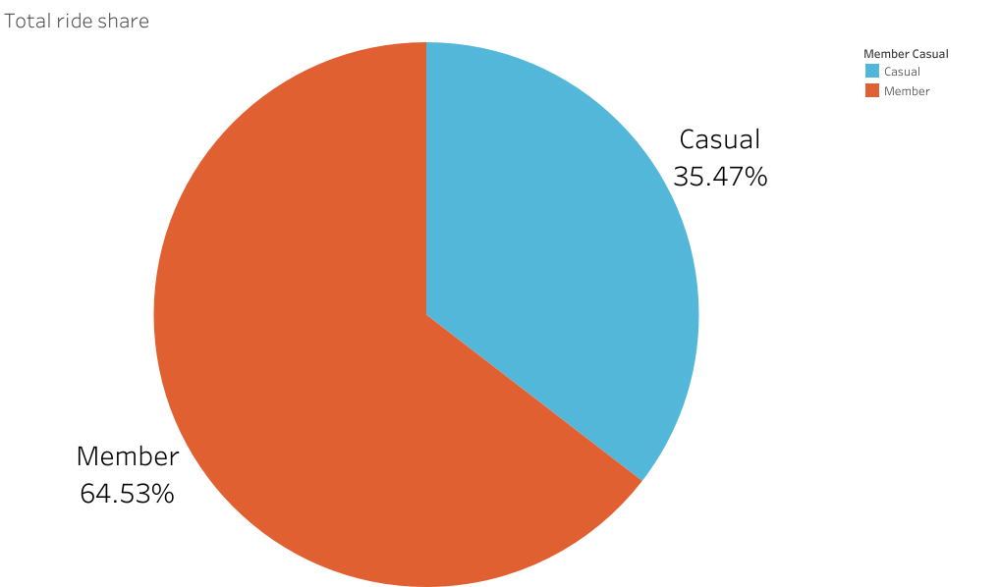
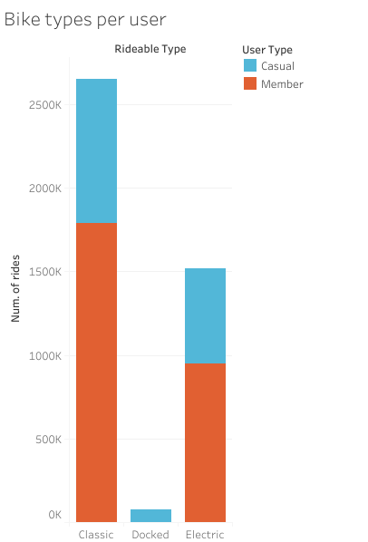
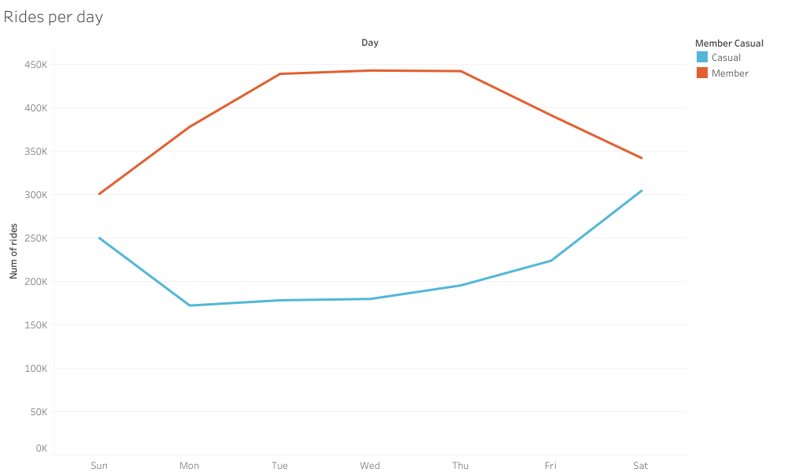
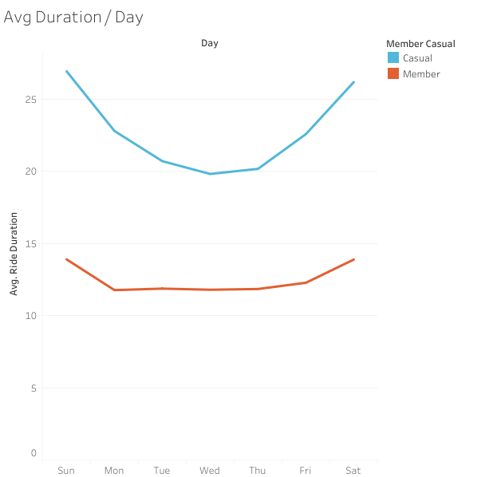
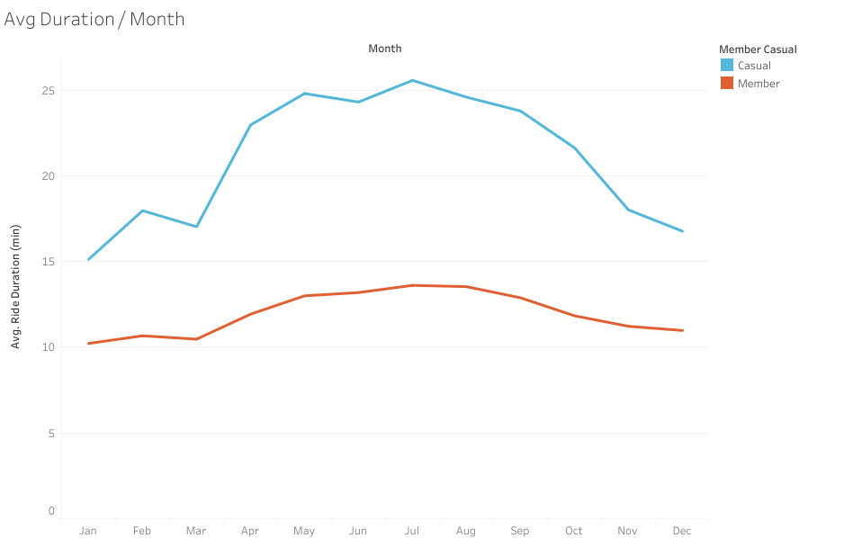

# Cyclistic Capstone Case Study
## Table of contents 

1. [Introduction](Capstone1.md#introduction) 
2. [Business Task Statement](Capstone1.md#business-task-statement) 
3. [Data Sources](Capstone1.md#data-sources) 
4. [Processing and Cleaning](Capstone1.md#processing-and-cleaning) 
5. [Analysis and Visualizations](Capstone1.md#analysis-and-visualizations) 
6. [Recommendations](Capstone1.md#recommendations)

---
###  Introduction

This case study is the capstone for the course Google Data Analytics Professional Certificate. 

The scenario involves being a marketing analyst at Cyclistic, a bike-share company. The bike-share program comprises 5824 bikes and 692 docking stations. Cyclistic distinguishes two types of users by their membership status: ‘Casual’ and ‘Members’.

 The future growth depends on maximizing the number of annual memberships. The team needs to understand the relationship between casual riders and members using the Cyclist bikes differently. Conversion of these casual riders to members is one of the opportunities suggested by the Marketing Director.

Based on the comprehensive data insights and visualizations, the team is tasked with formulating a strategic presentation for the executives i.e. conversion of existing casual riders to annual members.

---
###  Business Task Statement

***Create a marketing strategy to increase the number of annual members.***

> **Objective** : How do annual members and casual riders use Cyclistic bikes differently? To answer this question, the analyst must clean, analyze, and visualize the data.

---
### Data Sources

The data used in this case study is made available by Motivate International Inc. under a specific license. The data can be accessed from the Divvy Bikes data license agreement [here](https://divvybikes.com/data-license-agreement) .

Our dataset for the entire year of 2023 consists of 12 files, each representing a month. The files can be found [here](https://divvy-tripdata.s3.amazonaws.com/index.html). The data records include details such as ride ID, start and end times, types of bikes, and member types. However, it is important to note that the data does not contain any personal information.

The database tool utilized for this analysis is DBeaver with SQL.

---

### Processing and Cleaning

DBeaver is used to process the data; however, the database needs to be cleaned before it can be analyzed and visualized. Since the data is presented in a monthly format, all 12 files are combined into one file to create a yearly database, allowing for comprehensive processing.

The total number of records is 5,719,877 after combining the dataset into ‘Cyclistic2023’ using this [query](Data_combination.sql).

Now that the data has been combined, it needs to be explored before any cleaning occurs. The database contains some columns whose data types need to be changed.

The columns `started_at` and `ended_at` currently have a data type of `VARCHAR`, which will be converted to `TIMESTAMP`. The purpose of converting the data types for these two columns is to enable the extraction of additional columns later during data manipulation for better insights.
 
Now that the data types have been standardized, we proceed with Data Cleaning. 

> #### Data Cleaning

The cleaning was executed using this [query](Cleaning_data.sql). The total records before cleaning: `5,719,877`
 
The data cleaning process includes the removal of:
 
1. **Missing values**
   
	When the query was run, all rows containing an empty string or NULL value in any column were removed to enhance the analysis of our data.

2. **Duplicates**

	To check for duplicate values in the dataset, we considered the primary key column: ride_id. The difference between the total number of rows in ride_id and the distinct values in ride_id provided the number of duplicates in that column. The result returned was ‘0’ indicating no duplicate values.

3. **Inconsistencies**
   
	Rides with a duration of less than 1 minute or exceeding 1 day have been removed in order to prevent any values from skewing the data.

After cleaning the data, a total of **147,582** rows were removed. The queries were executed again to ensure that none of the records contained discrepancies. 

The final count of rows is now `5,572,295`.

> #### Data manipulation

There are 3 additional columns created with this [query](Data_manipulation.sql) for better analysis of our data set along with the existing columns.

1. **Ride Duration (in minutes)**: The column allows for a deeper understanding of customer behavior, helping the company identify peak usage times and optimize bike availability. 

2. **Days**: This column provides insights into patterns of bike usage, enabling targeted promotions or services on specific days.
   
3. **Month**: This column can reveal seasonal trends which could help optimizing inventory and tailor marketing strategies for specific times of the year.

---

### Analysis and Visualizations

From the 5.5 million records, we analyzed the data by running queries and creating visualizations, which helped us uncover the answers we sought and identify trends and patterns. The SQL [query](Data_Analysis.sql) were executed in DBeaver, while Tableau Public was used for the visualizations.

1) **Total Rides shared per user type**

 

*Insights*:

- Members account for 64.53% of the total rides, when compared to the casual users.

2) **Calculating Bike types used per user type**

*Insights*:
  
- The classic bike is the most frequently used, followed by electric bikes.    
- Only casual users utilize the docked bikes.
- Members have a higher ride count compared to casual users.

3.  **Distribution based on number or rides**

*Insights:*
 
-  Members primarily use the service for daily commutes, with significant ride spikes around 08:00 and 17:00, indicating peak office hours.  
- Casual riders tend to utilize the service more on weekends compared to weekdays.
- The number of rides peaks from May to September, likely due to favorable weather conditions for biking.

4.  **Distribution based on average duration of rides.**

*Insights*: 

- Casual riders have a longer average ride duration compared to members, suggesting their usage is primarily for leisure activities.
- Monthly data indicates that casual users ride most frequently during the summer, reinforcing the idea of leisure use.
- Members typically have a consistent ride duration of 10-15 minutes, indicating their primary use of the service for daily commuting, while casual users show more fluctuation in duration, averaging 15-25 minutes for leisure rides.

5. **Distance covered per month**

For this analysis, the start and end points are determined using latitude and longitude coordinates. The tool used here is Tableau, which allows for the creation of calculated fields.

>- Starting Point: MAKEPOINT([Start Lat], [Start Lng])
>- Ending Point: MAKEPOINT([End Lat], [End Lng])

The distance is calculated using the following formula, where ‘mi’ indicates that the distance is measured in miles:

> - Distance: DISTANCE([Starting Point], [End Point], 'mi')**

*Insights*:

- Casual users tend to increase their bike usage as the weather improves and vice versa, indicating a strong correlation with seasonal changes.
- Members have a more steady pattern of bike usage.
- The average distance covered by both user groups ranges between 1.0 and 1.4 miles.

6. Location where bikes were most picked up and dropped off, **Streeter Dt & Grand Avenue.**

---
### Recommendations 

**Targeted Marketing Strategies**: The lack of member sign-ups for docked bikes presents an opportunity to target casual users who frequently ride these bikes. 75,376 rides were taken by casual users on docked bikes which could definitely be targeted.   

**Seasonal Promotions**: The data shows that bike usage peaks during the summer months, indicating a prime time for promotional efforts
 
**Weekend Engagement Initiatives**: Since weekends are identified as the most popular days for bike usage based on average duration, special weekend events or promotions could be implemented to further encourage ridership.

---
